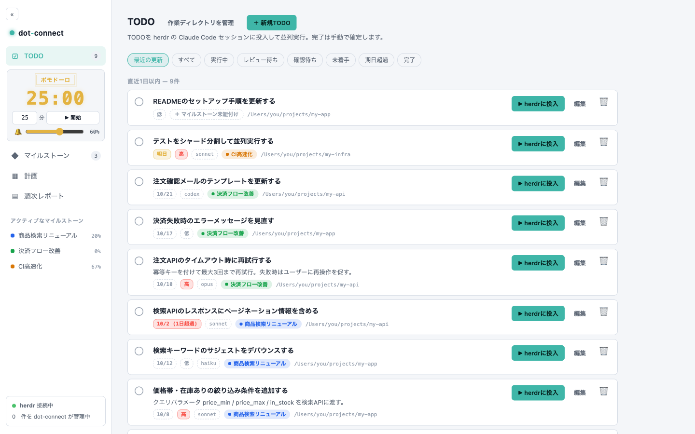
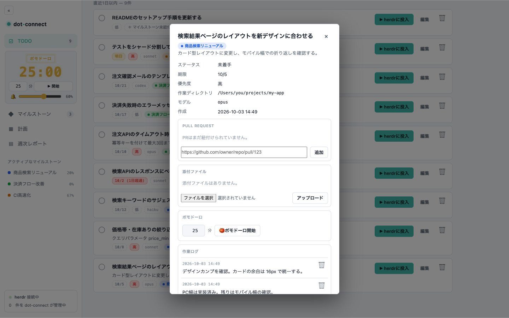
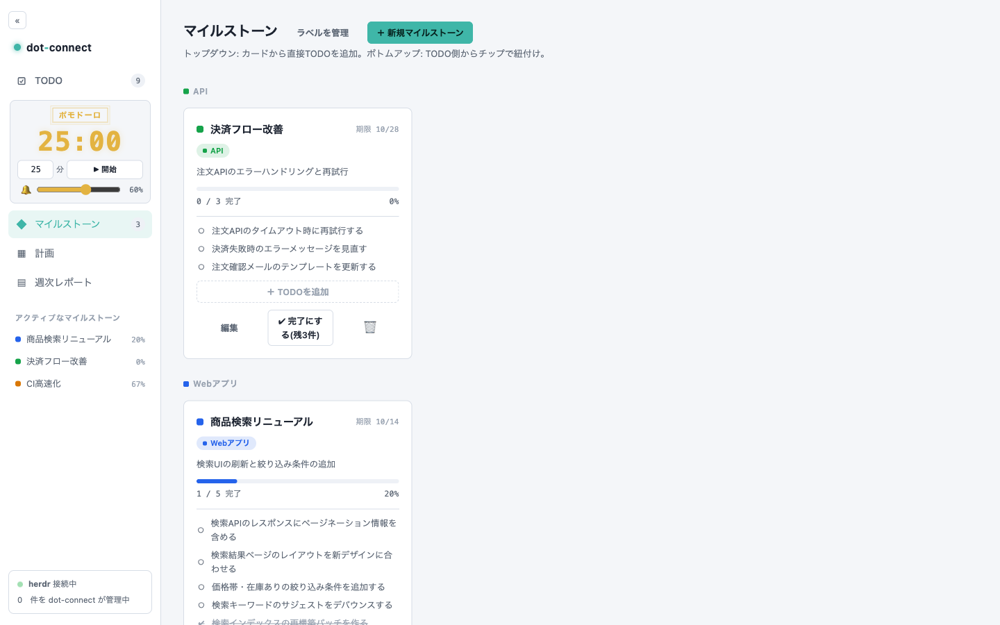
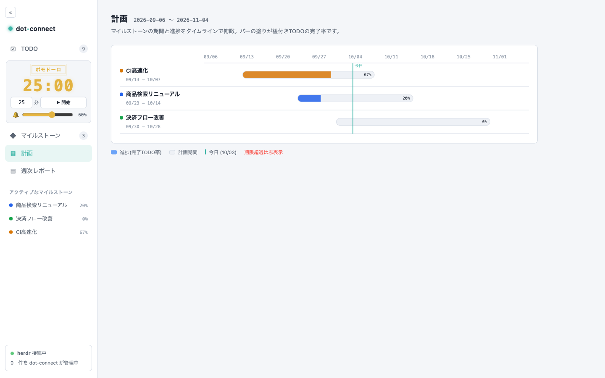

# dot-connect

TODO管理 + マイルストーン管理 + herdr連携のローカルWebアプリ。TODOをそのまま
herdr上のClaude Code / Codex CLIセッションとして投入(dispatch)し、進捗を
同じ画面で追える。ブラウザ版と、同じUIを同梱したデスクトップアプリ(Tauri)
の2形態で動く。



## スクリーンショット

| TODO詳細(PR紐付け・添付・ポモドーロ・作業ログ) | マイルストーン |
| --- | --- |
|  |  |

| 計画(マイルストーンのタイムライン) |
| --- |
|  |

スクリーンショットのデータは `scripts/seed-demo.ts` で再現できる(手順は
[デモデータ](#デモデータ)を参照)。

## 主な機能

- **TODO**: 説明・優先度・期日・作業ディレクトリ・モデルを持つTODOの管理。
  期限切れ/最近の更新での絞り込みと並び替え、詳細ダイアログ
- **マイルストーン / ラベル**: マイルストーンごとの進捗表示、ラベルでの
  グルーピング
- **herdrへの投入**: プロンプト(履歴・スニペット・`{{title}}` /
  `{{description}}` プレースホルダ)を付けてTODOをエージェントセッションとして
  起動。セッション状態の同期、完了時のワークスペースclose
- **添付ファイル**: TODOへのファイル添付と、投入時に含める添付の選択
- **作業ログ**: TODOごとのコメント(作業ログ)
- **PullRequest紐付け**: GitHub PRのURLをTODOに紐付け、`gh` でタイトル・状態を
  取得。openなPRを持つTODOは「レビュー待ち」として表示
- **週次レポート**: `claude -p` による週次レポートの生成
- **ポモドーロタイマー**: TODOに紐付けた集中タイマー(終了時チャイム、音量調整)
- **外部連携**: 許可リスト方式のAPIトークン認証、stdio MCPサーバー

## スタック

Bun + TypeScript / Hono / zod / bun:sqlite(デスクトップ版は Tauri v2)

## セットアップ

前提: [Bun](https://bun.sh)。投入(dispatch)機能を使う場合は加えて `herdr` と
`claude`(任意で `codex`)のCLI、PR情報の取得には `gh` が必要(いずれも無くても
TODO管理自体は動く)。投入とセッションを開く操作はmacOSのみ対応。

```bash
bun install
bun run src/server.ts   # http://localhost:5757
```

## 環境変数

| 変数 | 既定値 | 説明 |
| --- | --- | --- |
| `PORT` | `5757` | HTTPサーバーのポート |
| `DB_PATH` | `<リポジトリルート>/data/dot-connect.db`(絶対パス) | SQLiteファイルパス |
| `HERDR_BIN` | `herdr` | herdr CLIのパス |
| `CLAUDE_BIN` | `claude` | claude CLIのパス |
| `CODEX_BIN` | `codex` | Codex CLIのパス(モデルに `codex` を選んだ投入で使う) |
| `GH_BIN` | `gh` | GitHub CLIのパス。TODOに紐付けたPRのタイトル・状態の取得にのみ使う(読み取り専用)。未インストール/未認証でもPR URLの登録自体は成功し、取得できなかった理由がそのPRに記録される |
| `TERMINAL_APP` | (未設定) | 設定時のみ open-session で osascript activate |
| `HOST` | `127.0.0.1` | バインドアドレス。loopback (`127.0.0.1`/`localhost`/`::1`) 以外に変更する場合は `DOT_CONNECT_API_TOKEN` の設定が必須(未設定だと起動を拒否する) |
| `DOT_CONNECT_API_TOKEN` | (未設定) | 外部からのAPIアクセス用トークン。未設定ならAPIトークン認証は無効(従来どおりブラウザの同一オリジンアクセスのみ) |
| `DOT_CONNECT_ALLOWED_MODELS` | `opus,sonnet,haiku,fable,codex` | TODOの`model`(投入時に使うClaude Codeのモデル。`codex` だけは特別で、Claude Codeの代わりにCodex CLIを起動する)に指定できる値のカンマ区切り許可リスト。ここに無い値はTODOの作成/更新/投入で400になる |
| `STATIC_DIR` | `<リポジトリルート>/public`(絶対パス) | 静的フロントエンドの配信元。相対パスはリポジトリルート基準で絶対化される |
| `DOT_CONNECT_DESKTOP` | (未設定) | デスクトップアプリのシェルがサイドカー起動時に設定する。stdinのEOFで自己終了するようになるため、通常は手で設定しない |
| `DOT_CONNECT_MCP_BIN` | (未設定) | 同梱MCPサーバーのバイナリパス。デスクトップアプリのシェルが設定し、設定ダイアログの「MCP登録コマンド」に使われる |

`DB_PATH` の既定値はカレントディレクトリに依存しない絶対パスに解決される
(`src/config.ts` 自身のファイル位置からリポジトリルートを求め、そこからの
絶対パスにする)。どのディレクトリから `bun run src/server.ts` を起動しても
常に同じDBファイルを見るため、起動場所の違いでデータが消えたように見える
事故を防いでいる。`DB_PATH` を明示的に指定する場合、絶対パスならそのまま、
相対パスならリポジトリルート基準で絶対化される(cwd基準ではない)。起動時に
実際に使用しているDBパスは stderr のログ(`Using database at ...`)で確認できる。
親ディレクトリ(既定では `data/`)が存在しない場合は起動時に自動作成される。

## ディレクトリ構成

```
src/
  config.ts, logger.ts
  db/            # bun:sqlite マイグレーション + リポジトリ (todos/milestones/labels/workspaces/reports ほか)
  herdr/         # exec (ExecFn注入) / herdrClient / statusSync
  services/      # dispatchService / sessionService / reportService / claudeRunner ほか
  api/           # zodバリデーション付きHonoルート、apiTokenAuth/csrf
  mcp/           # MCPサーバー(stdio)。HTTP API経由でtodos/milestones/labels/workspacesとPR紐付けのみ操作
  server.ts
public/          # 静的フロントエンド(ビルド不要の素のHTML + ESモジュール)
desktop/         # Tauri v2 のデスクトップアプリシェルとサイドカーのビルドスクリプト
data/            # 既定のSQLite置き場(DB本体は .gitignore 済み)
tests/           # bun:test。herdr/claude/実サーバーはすべてフェイク注入、実行しない
```

## 外部からのAPIアクセス(APIトークン)

`DOT_CONNECT_API_TOKEN` を設定すると、`Authorization: Bearer <token>` ヘッダを
持つリクエストがブラウザの同一オリジン制限(CSRF)なしにAPIへアクセスできる
ようになる。ただし**アクセスできるのは todos / milestones / labels /
workspaces の CRUDエンドポイント、TODOのPR紐付け
(`/api/todos/:id/pull-requests` 配下)、`GET /api/models` のみ**(許可リスト
方式。新しいエンドポイントが増えても、このリストに明示的に追加しない限り
外部トークンからは使えない)。

**意図的に外部トークンからは使えないエンドポイント**(実行コスト・RCEリスク
があるため):
- `POST /api/todos/:id/dispatch`(任意のディレクトリで任意のプロンプトの
  Claude Codeセッションを起動する。実質的にRCE)
- `POST /api/todos/:id/open-session`(osascriptを実行する)
- `POST /api/reports/weekly/generate`(`claude -p` を実行してコストが発生する)
- `POST /api/herdr/sync`

トークンが間違っている場合は401、許可されていないエンドポイントを叩いた
場合は403が返る。トークンが正しい場合、Originが不正でも(=ブラウザ以外の
クライアントでも)アクセスできる。

### バインドアドレスによる挙動の違い(重要)

- **`HOST=127.0.0.1`(既定、loopback)の場合**: 従来どおり、このマシン上の
  プロセスしか到達できない前提の脅威モデルのまま。トークンを送らないリクエ
  ストは(ブラウザと同じ)Origin/Sec-Fetch-Siteベースの同一オリジンチェック
  にフォールバックする。
- **`HOST` を loopback 以外(`0.0.0.0` など)に変更した場合**: **`/api/*` への
  全リクエスト(GETを含む)で有効なトークンが必須になる。** `Authorization`
  ヘッダが無ければ即401。Origin/Sec-Fetch-Siteは非loopback時には信頼しない
  ——これらはブラウザ以外のクライアントが自由に詐称できるヘッダであり、
  ネットワーク越しに到達できる相手には偽装される前提で扱う必要があるため。
  そもそも `DOT_CONNECT_API_TOKEN` が未設定だと起動そのものを拒否する(前述)。
- **ブラウザUI(`public/` の静的配信)は非loopback時には配信されない。**
  SPAはAPIトークンを安全に保持できないため、非loopbackでUIだけ配信しても
  結局どのAPIも呼べない。中途半端に見せるよりも配信自体を止める設計にして
  いる。非loopback時に `/` 等へアクセスすると404
  (`ブラウザUIは非loopbackバインドでは配信されません`)が返る。

### 設定手順

```bash
# ランダムなトークンを生成する例
export DOT_CONNECT_API_TOKEN=$(openssl rand -hex 32)
bun run src/server.ts
```

起動ログに `APIトークン認証: 有効` と出れば設定完了。以降、以下のように
アクセスできる:

```bash
curl -H "Authorization: Bearer $DOT_CONNECT_API_TOKEN" http://127.0.0.1:5757/api/todos
```

LAN上の別ホストからアクセスしたい場合は `HOST=0.0.0.0` などを設定するが、
その場合 `DOT_CONNECT_API_TOKEN` の設定が**必須**になる(未設定だと起動時に
エラーで拒否される)上、**ブラウザUIは配信されなくなり、すべてのリクエスト
にトークンが必要になる**(上記参照)。LANからはAPI/MCP経由でのみ利用する
運用を前提とすること。

## MCPサーバー

`src/mcp/server.ts` は dot-connect の HTTP API を叩く stdio MCPサーバー。
DBを直接は触らず、既存のバリデーション・エラーメッセージをそのまま利用する。

### 環境変数

| 変数 | 既定値 | 説明 |
| --- | --- | --- |
| `DOT_CONNECT_URL` | `http://127.0.0.1:5757` | dot-connectサーバーの接続先 |
| `DOT_CONNECT_API_TOKEN` | (未設定) | dot-connectサーバー側と同じトークン。サーバー側で設定している場合は必須 |

### Claude Code への登録手順

```bash
claude mcp add dot-connect \
  --env DOT_CONNECT_URL=http://127.0.0.1:5757 \
  --env DOT_CONNECT_API_TOKEN=<サーバーに設定したトークン> \
  -- bun run --cwd /path/to/dot-connect mcp
```

(または `bun run /path/to/dot-connect/src/mcp/server.ts` を直接指定してもよい。
`package.json` に `"mcp": "bun run src/mcp/server.ts"` スクリプトを用意してある。)

登録後、`claude mcp list` で `dot-connect` が表示されることを確認する。

### 利用可能なツール

- TODO: `list_todos`(status/milestoneIdで絞り込み、各TODOに`workspacePath`と
  `model`を含む)、`create_todo`、`update_todo`(title/description/
  milestoneId/workspacePath/model)、`complete_todo`、`reopen_todo`、
  `delete_todo`
- マイルストーン: `list_milestones`、`create_milestone`、`update_milestone`、
  `complete_milestone`(未完了TODOが残っていると件数つきでエラーになる)、
  `reopen_milestone`、`delete_milestone`
- ラベル: `list_labels`、`create_label`、`update_label`、`delete_label`
- 作業ディレクトリ(workspace): `list_workspaces`、`create_workspace`、
  `update_workspace`、`delete_workspace`(よく使う作業ディレクトリを登録して
  おく入力補助リスト。詳細は後述)
- PR紐付け: `add_todo_pull_request`、`refresh_todo_pull_request`、
  `remove_todo_pull_request`(詳細は後述)

**PullRequestの紐付け**: 1つのTODOに複数のGitHub PRのURLを登録できる。
URLは`https://github.com/{owner}/{repo}/pull/{number}`に正規化して保存される
ため、末尾の`/files`や`#discussion_r…`が付いた形で貼っても同じPRとして扱われ、
同一TODOへの二重登録は409になる(github.com のみ対応)。登録時に`gh pr view`で
タイトル・状態(open/closed/merged)・draftかどうかを取得して保存する。取得は
登録時と`refresh_todo_pull_request`の明示実行時のみで、自動同期はしない。
**`gh`が未インストール・未認証・privateリポで権限がない場合でもURLの登録自体は
成功し**、取得できなかった理由が`fetchError`に入る(前回取得に成功していれば、
その時点のタイトル・状態は消さずに残す)。紐付けたPRは`list_todos`など各TODOの
`pullRequests`配列に含まれる。

**`workspacePath`(TODOをherdrに投入する際の作業ディレクトリ、絶対パス)**:
`create_todo`/`update_todo`では任意項目。ただし実際にherdrへ投入
(dispatch、後述のとおりMCP経由では非公開)する際には必須になるため、投入先
が決まっているTODOはMCP経由の作成/更新時に設定しておくとよい。
`update_todo`に`workspacePath: null`を指定すると設定済みの値をクリアできる
(空文字/空白のみを指定した場合も同様にクリア扱いになる)。

**登録済みの作業ディレクトリ(`list_workspaces`など)**: `workspacePath`の
入力補助のための名前付きリスト(`name`, `path`)。`todos.workspace_path`は
このリストへの参照(FK)ではなく、常にパス文字列そのもののコピーを保持する
設計になっているため、登録した作業ディレクトリを`delete_workspace`で削除
しても、既にそのパスを`workspacePath`として設定済みのTODOには一切影響しない。

**作業ディレクトリの履歴**: 上の「登録済みリスト」が手で登録するスニペット
なのに対し、履歴はherdrへの**投入が成功したときだけ**自動記録される名前なし
のパス一覧(最大50件、同じパスの再利用は先頭に繰り上がる)。プロンプト履歴と
同じ仕組み(`src/db/recencyHistory.ts`を両者で共有)。Web UIの「作業ディレクトリ
管理」から一覧・登録済みへの昇格・全消去ができ、投入ダイアログの「履歴から
選ぶ」でも使える。ブラウザUI専用のため、APIトークン/MCPからは操作できない。

**`model`(TODOを投入する際に使うClaude Codeのモデル)**: `create_todo`/
`update_todo`では任意項目(未指定/nullなら既定モデル)。指定できる値は
サーバー側の許可リスト(既定で`opus`/`sonnet`/`haiku`/`fable`/`codex`、
`DOT_CONNECT_ALLOWED_MODELS`で変更可)に含まれるものだけで、それ以外は
400になる。`codex`を指定したTODOは、投入時に`claude --model …`ではなく
Codex CLI(`CODEX_BIN`)をそのまま起動する。herdrがCodexの状態を検知できるよう、
事前に`herdr integration install codex`を済ませておくこと。`workspacePath`と同様、`update_todo`に`model: null`を指定すると
設定済みの値をクリアできる。

**`dispatch`(Claude Codeセッションの起動)はMCP経由でも意図的に公開して
いない。** herdr投入は任意ディレクトリで任意プロンプトのエージェントを
起動する操作であり、外部(MCPクライアント含む)からの実行はRCEに等しいため。
dispatchが必要な場合は、dot-connectのWeb UIから直接操作すること。

**ただし `complete` は herdr のワークスペースを閉じる。** TODOを完了すると、
そのTODOのために開いたワークスペースを畳む(ペインとスクロールバックが消える)。
起動ではないのでRCEではないが、`complete` はMCP・APIトークンの双方から到達
できるので、外部クライアントが herdr を破壊的に操作しうる唯一の経路になる。
安全側の作りとして、畳む直前に herdr へ実状態を問い合わせ、`idle` か `done`
と**確認できたときだけ**閉じる —— `working`(処理中)と `blocked`(許可ダイア
ログ待ち)、状態を確認できなかった場合は開いたまま残す。

## デスクトップアプリ(macOS / Windows)

`desktop/` に Tauri v2 のシェルがある。`bun build --compile` で単一実行ファイル
にしたサーバーとMCPサーバーを**サイドカー**としてバンドルに同梱し、アプリ起動時
にRust側がサーバーを起動して、その `http://127.0.0.1:<port>` を WebView で開く。
Bunのインストールもリポジトリのcloneも要らない配布形態にするためで、ブラウザ版と
同じ `public/` をそのまま表示している(UIのコードは共通)。

### ビルド前提

| 必要なもの | 用途 |
| --- | --- |
| Rust(rustup 経由の stable) | Tauri本体のビルド |
| Xcode Command Line Tools | macOSのリンカ・WebKit |
| Bun | サイドカーの `bun build --compile` |
| `@tauri-apps/cli` | `desktop/package.json` の devDependency。`cd desktop && bun install` で入る |

### ビルド

```bash
cd desktop && bun install    # 初回のみ(@tauri-apps/cli の取得)
./desktop/build-sidecars.sh  # サイドカー2本をビルド(リポジトリルートから実行)
cd desktop && bun x tauri build
```

生成物は以下:

- `desktop/src-tauri/target/release/bundle/macos/dot-connect.app`(約128MB)
- `desktop/src-tauri/target/release/bundle/dmg/dot-connect_0.1.0_aarch64.dmg`(約47MB)

サイズの大半はサイドカー2本(各約60MB)で、これは `bun build --compile` が
Bunランタイムごと同梱するため。未署名ビルドなので `signature` 関連の警告が
出るが無視してよい。

インストールは `.app` を `/Applications` にコピーするだけ:

```bash
rm -rf /Applications/dot-connect.app
cp -R desktop/src-tauri/target/release/bundle/macos/dot-connect.app /Applications/
```

**cloneした直後は必ず `./desktop/build-sidecars.sh` を先に実行すること。**
`desktop/src-tauri/binaries/` は `.gitignore` 済みで、サイドカーのバイナリは
リポジトリに入っていない。Tauriは `externalBin` に指定されたファイルの実在を
ビルド時に検証するため、これを飛ばすと `cargo check` すら通らない。

### データの置き場所

| パス | 中身 |
| --- | --- |
| `~/Library/Application Support/net.tech-square.dot-connect/dot-connect.db` | SQLite本体(`-wal` / `-shm` も同じ場所) |
| `~/Library/Application Support/net.tech-square.dot-connect/logs/server.log` | サイドカーのstdout/stderr。起動失敗の調査はまずここ |

リポジトリ運用時の `data/dot-connect.db` とは**別のファイル**なので、両方を
起動しても互いのデータを壊さない。

ポートは 5757 が空いていればそれを使い、塞がっていればOSが割り当てた空きポート
を使う(`bun run src/server.ts` を同時に動かしていても衝突しない)。実際に使って
いるポートは `server.log` の `LISTENING <port>` 行でわかる。

### 初回起動

DBがまだ無い初回だけ「既存の dot-connect.db をインポートしますか?」という
ダイアログが出る。「インポート」を選ぶとファイル選択が開き、選んだ `.db` を
`-wal` / `-shm` ごと上記の場所にコピーしてからサーバーが起動する(リポジトリ
運用から移行する場合は `data/dot-connect.db` を選ぶ)。「新規で始める」を選べば
空のDBで始まる。2回目以降はDBが既に存在するのでダイアログは出ない。

コピーに失敗した場合は中途半端な `.db` を消してから起動エラーを表示する。
残してしまうと次回が「初回」と見なされず、空のDBのまま二度とインポートを
提案できなくなるため。

### MCPサーバーの登録

デスクトップ版はMCPサーバーのバイナリも同梱しているため、`bun` も
リポジトリのパスも指定せずに登録できる。メニューの **File > 設定…**
(⌘,) を開くと接続情報のダイアログが出るので、**「MCP登録コマンド」** 行の
**「コピー」** ボタンでコマンドがクリップボードに入る。ターミナルに貼って
実行する:

```bash
claude mcp add dot-connect --env DOT_CONNECT_URL=http://127.0.0.1:5757 \
  -- "/Applications/dot-connect.app/Contents/MacOS/dot-connect-mcp"
```

この行は `GET /api/capabilities` が `mcpBinPath` を返すデスクトップ版でのみ
ダイアログに表示され、ブラウザ版(`bun run src/server.ts`)では出ない。登録
できるバイナリが存在しないため。ブラウザ版での登録手順は前述の「Claude Code
への登録手順」を参照。

なお、ポートが 5757 以外にフォールバックしている状態でコピーすると、その
実際のポートが `DOT_CONNECT_URL` に入る。ポートは起動ごとに変わりうるので、
5757 が空いている状態で登録しておくのが望ましい。

### Gatekeeper(配布したビルドを開くとき)

未署名・未notarizeのため、DMG等で配布したビルドを他のMacで初めて開くと
Gatekeeperにブロックされる。**「システム設定 > プライバシーとセキュリティ」**
を開き、下の方に出ている「"dot-connect" は開発元を確認できないため……」の
横の **「このまま開く」** を押す。以降は通常どおり起動できる。

自分でビルドしたバイナリをそのまま `/Applications` にコピーした場合は
quarantine属性が付かないので、この操作は要らない。

### Windows版

`desktop/build-windows.md` を参照。`.msi` の生成はWindows実機でしか行えない。

## テスト

```bash
bun test               # 全テスト
bun test --coverage    # カバレッジ付き
bun run typecheck      # tsc --noEmit
```

## デモデータ

スクリーンショット用のサンプル(ラベル3件・マイルストーン3件・TODO 12件)を
HTTP API経由で投入するスクリプトがある。普段使いのDBを汚さないよう、**必ず
別の `DB_PATH` で起動したサーバーに向けて**実行すること。

```bash
DB_PATH=/tmp/dot-connect-demo.db PORT=5858 bun run src/server.ts
# 別のターミナルで
DOT_CONNECT_URL=http://127.0.0.1:5858 bun run scripts/seed-demo.ts
```

## 安全上の注意

herdr/claude の呼び出しはすべて `ExecFn` (または `HerdrClient`/`ClaudeRunner`) 経由で行われ、
テストでは実バイナリを一切実行しない。開発中に `herdr` の状態を変更する操作(workspace/pane
の作成・close・run等)を直接実行することは避けること。

## ライセンス

[MIT License](LICENSE)

### Herdr の対応版・定期チェック

設定画面（サイドバーの **Herdr 設定**、デスクトップでは `⌘,`）に、インストール済み版、対応状況、操作ごとのCLI形式検出結果、最終確認・前回成功・次回確認日時、検出した版の変更を表示します。**今すぐ再確認**でキャッシュを更新できます。公開最新版は照会せず「未確認」と表示します。インストール済み版と対応版、公開最新版を混同しません。Herdrの自動更新・外部への情報送信は行いません。

| Herdr 版 | dot-connect の扱い | 送信動作・差分 |
| --- | --- | --- |
| 0.9.3 | 公式ソース＋実CLIの引数・隔離モック通信を検証（実エージェント送信は未検証） | `agent prompt <target> <text>`（区切りの `--` は非対応）。入力と送信をHerdrに任せ、追加のEnterや自動再入力をしない。`agent send`は存在しない |
| その他（旧版・プレリリースを含む） | 未検証。新規依頼送信を停止 | 検出できた操作のみ表示。`agent send`等への推測によるフォールバックなし |

0.9.3で確認する操作は `api snapshot`、`workspace create --cwd --label --no-focus`、`pane run`、`agent prompt`、`pane read --source visible`、`pane send-keys`、`tab focus`、`workspace close` です。操作ごとの `--help` のUsageと必要なオプションを検査します。版番号が一致してもCLI形式と実引数パーサーを確認できなければ送信を停止します。ヘルプのUsage一致だけでは送信を許可しません。

- 起動時と通常24時間ごとに `--version` / `--help` と、対応版に限り副作用のない引数パーサー検査を実行。各プロセスのタイムアウトは3秒。チェックの同時実行はまとめます。
- `DOT_CONNECT_HERDR_CHECK_INTERVAL_MS` で周期を変更できます（既定 `86400000`、最小 `60000`、最大 `2592000000`）。変更はサーバー再起動後に反映されます。
- 結果はプロセス内キャッシュです。再起動時は取り直します。休止から復帰した後は最大1分以内、設定画面の表示・再フォーカス時は期限を過ぎていれば再確認します。確認失敗・未インストール・不明時は成功結果を送信許可に流用せず、1分後から再確認可能です。
- 依頼送信時はワークスペース作成前と本文送信直前にも強制再確認するため、定期チェックの直後にHerdrが更新されても古いキャッシュで送信しません。
- 本文はシェルを介さず配列の1引数として渡します。改行・空白・日本語・引用符を保持し、先頭ハイフンも本文の位置に直接渡します。区切り用 `--` は挿入しません。
- 送信後の確認失敗やクライアントのタイムアウトでは、依頼を自動再送せずセッションを残して確認を促します。まずセッションを開いて受信済みか確認してください。同じTODOの同一サーバー内の同時依頼も拒否します。

対応版を追加するときは `src/herdr/compatibility.ts` の `HERDR_VERIFIED_VERSIONS` と操作定義を更新します。公式CLIの各 `--help` で入力形式・送信有無を確認し、意味が変わる場合は `herdrClient.ts` のアダプターを明示的に追加してください。版番号だけで新しい送信経路を許可しないでください。ヘルプ上の互換性は引数パーサーや実際のTUIの挙動を保証しません。送信用と同じargvビルダーで、日本語改行・引用符・先頭ハイフン・`--help`・`--` 本文の後ろに意図的な無効オプションを付け、本文でなく末尾オプションが拒否されることを検査します。`HERDR_SOCKET_PATH` は専用一時ディレクトリ内の存在しないソケットに固定し、予期しない解析結果でも実サーバーへは接続しません。対応表には検証範囲を記録します。

検証は `bun test`、`bun run typecheck`、`./desktop/build-sidecars.sh`。互換性・変更検知・キャッシュ・エラー・未知版の送信停止は `tests/herdr/compatibility.test.ts`、本文のargvと重複送信は `tests/herdr/exec.test.ts` および `tests/services/dispatchService.herdrIntegration.test.ts` で、実エージェントを呼ばず検証します。型検査にはPATH上のTypeScriptコンパイラが必要です。

既知の制限: キャッシュ・同時依頼ロックはプロセス単位です。同じDBを複数サーバーから操作する構成の排他や、チェック完了とコマンド起動の極短い間に実行ファイルが置換される競合は保証しません。既存セッションの状態同期・表示操作は引き続き従来のエラー処理を使います。Herdrの定期確認はブラウザを閉じてもサーバー起動中に動作しますが、アプリ終了中は実行されません。


#### Herdr 0.9.3 の引数規則の実検証（2026-10-05）

公式タグv0.9.3の固定コミット `7b116c05bfda646af39d2524c54e70c751f57ee8` の
[`agent_prompt`](https://github.com/herdrdev/herdr/blob/7b116c05bfda646af39d2524c54e70c751f57ee8/src/cli/agent.rs#L777) は、最初の2引数をtarget/textにし、3引数目以降だけをオプションとして解析します。`--`を前置するとtargetが`--`、textが本来のtargetになり、本来の本文が `unknown option` で拒否されます。以前のヘルプのみの検証はこの差を検出できませんでした。

[`session::configure_from_args`](https://github.com/herdrdev/herdr/blob/7b116c05bfda646af39d2524c54e70c751f57ee8/src/session.rs#L29) と
[`extract_remote_args`](https://github.com/herdrdev/herdr/blob/7b116c05bfda646af39d2524c54e70c751f57ee8/src/remote/args.rs#L35) が先に全体を処理するため、本文そのものが `--session`、`--remote`、`--remote-keybindings`、`--handoff` と一致する場合、および先頭が `--session=`、`--remote=`、`--remote-keybindings=` の場合は送信前に明示エラーにします。NULも拒否します。黙って本文を書き換えず、ユーザーが通常の文章を先頭に加える方式です。通常のハイフンや本文中のオプション風文字列は保持します。

実インストール済みCLIの回帰テスト（任意、Unixソケットを利用できる環境で実行）:

```bash
HERDR_CLI_TEST_BIN=/Users/go/.local/bin/herdr bun test tests/herdr/herdrCliParser.test.ts
```

テストは `/tmp` の隔離モックソケットにだけ接続し、`ping`→`agent.prompt` の合成target/textが完全一致することを検証します。日本語複数行・空白・引用符・先頭ハイフン・`--wait`・`--help`・`--`を含み、不正な区切り形式のexit 2も再現します。実エージェントや実LP依頼を使いません。通常の `bun test` ではこのテストだけスキップされます。定期確認UIの「CLI引数検証済み」は実パーサー検査まで通過した意味で、実エージェントの受信保証ではありません。
